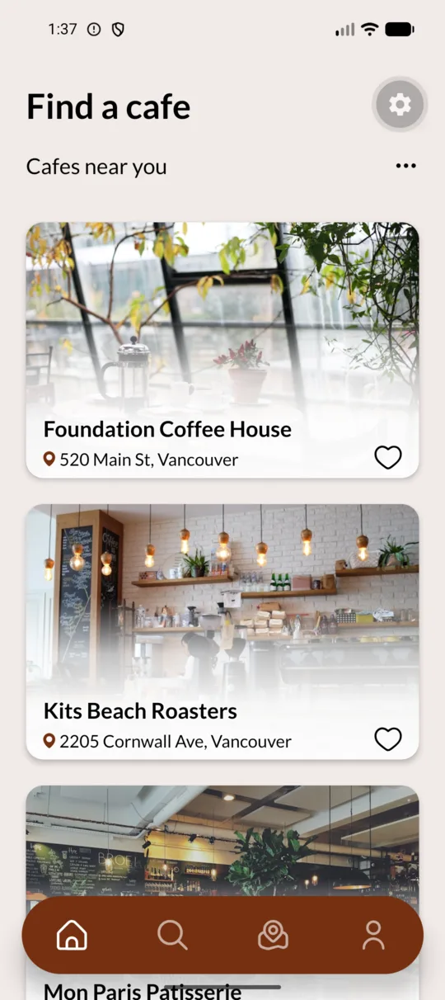
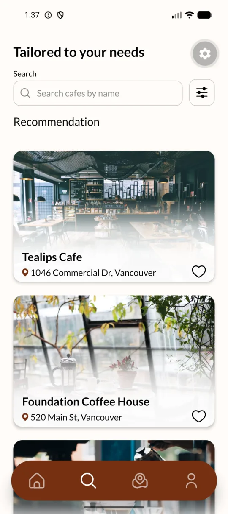
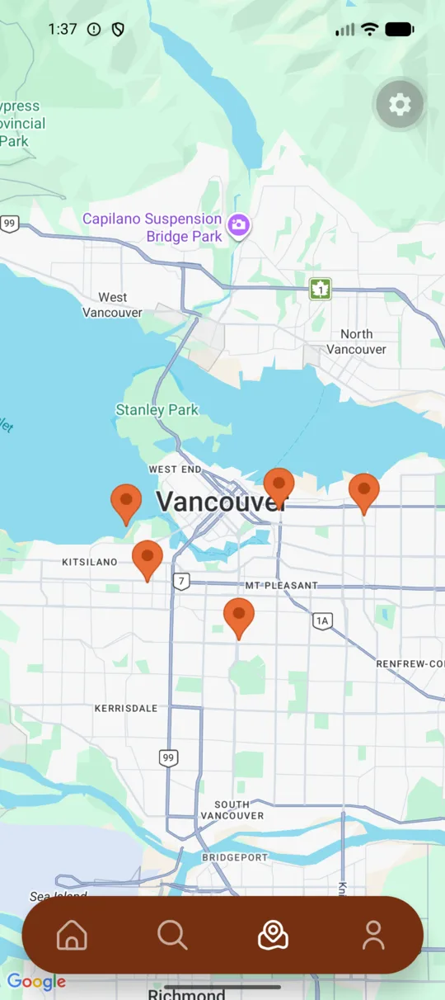
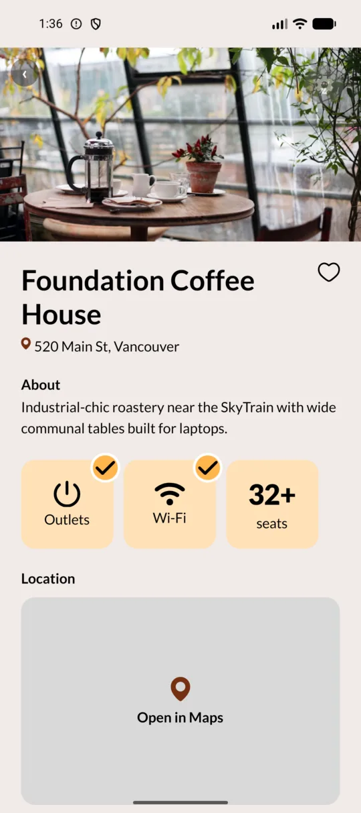

<p align="center">
  
</p>

<h1 align="center">VanCafe Listing</h1>

<p align="center">
  Find Vancouver cafes that work as well as you do.
</p>

VanCafe Listing is a mobile discovery app for remote workers and commuters. It helps people find cafes with reliable Wi-Fi, outlets, useful seating, parking, and the right atmosphere.

## App preview

<p align="center">
  
  
  
  
</p>

<p align="center">
  <sub>Home · Search · Map · Cafe details</sub>
</p>

## What VanCafe does

- Lists nearby cafes with location-aware sorting.
- Searches cafes by name and stores private recent searches.
- Filters results by distance, workspace essentials, price, seating, and atmosphere.
- Plots cafe locations on an interactive Google map.
- Shows work-focused details such as Wi-Fi, outlets, seating, and distance.
- Saves private favourites for authenticated users.
- Supports email, username, and Google authentication through Supabase.
- Lets users edit their profile, upload an avatar, log out, and delete their account.

## Technology

| Area              | Technology                                                       |
| ----------------- | ---------------------------------------------------------------- |
| Mobile app        | React Native, Expo SDK 57, Expo Router, TypeScript               |
| Data fetching     | TanStack Query, Supabase JavaScript client                       |
| Backend           | Supabase Postgres, Auth, Storage, and Edge Functions             |
| Maps and location | `react-native-maps`, Google Maps on Android, Expo Location       |
| UI                | Lato, React Native SVG, repository-owned design tokens and icons |
| Product workflow  | OpenSpec changes, specifications, and task ledgers               |

## Architecture

```text
Expo Router screens
        │
        ├── TanStack Query and app contexts
        │
        ├── Supabase Auth and session handling
        │
        ├── Supabase Postgres with row-level security
        │
        ├── Supabase Storage for cafe photos and avatars
        │
        └── Supabase Edge Functions for protected account actions
```

The client uses the Supabase public URL and anon key. Postgres row-level security protects user-owned data. Server-only credentials remain inside Supabase Edge Functions.

## Getting started

### Prerequisites

- Node.js and npm
- Android Studio with an emulator, or Xcode with an iOS simulator
- A Supabase project
- A Google Maps Android API key for Android map tiles
- The Supabase CLI, if you will apply migrations or deploy Edge Functions locally

### Install

```bash
git clone https://github.com/VanCafeListing/vcldev.git
cd vcldev
npm install
cp .env.example .env
```

Add these values to `.env`:

```dotenv
EXPO_PUBLIC_SUPABASE_URL=https://your-project-ref.supabase.co
EXPO_PUBLIC_SUPABASE_ANON_KEY=your-anon-key
GOOGLE_MAPS_ANDROID_API_KEY=your-google-maps-android-key
```

The Supabase anon key is public client configuration. Never place the Supabase service-role key or OAuth client secrets in `.env`.

### Configure Supabase

The app expects the database schema, row-level security policies, seed cafe data, and storage buckets from this repository.

From the repository root, link the project and apply the migrations:

```bash
supabase login
supabase link --project-ref your-project-ref
supabase db push
```

Deploy the protected account functions:

```bash
supabase functions deploy sign-in
supabase functions deploy delete-account
```

Create the `avatars` and `cafe-photos` Storage buckets in the Supabase dashboard. Keep the bucket access rules consistent with the policies in `supabase/migrations/`.

Configure the authentication providers that the team will test in the Supabase dashboard. Add this redirect URL under Authentication settings:

```text
vancafelisting://auth/callback
```

Google and Apple sign-in also require their provider credentials. Apple sign-in requires an Apple Developer account.

### Run

```bash
# Start the Expo development server
npm start

# Build and run the native Android app
npm run android

# Build and run the native iOS app
npm run ios
```

The Android and iOS directories are generated locally and are not committed. The first native run creates the platform project and installs the native dependencies. Android requires an emulator or connected device. iOS requires macOS, Xcode, and CocoaPods.

The Android Maps key must have Maps SDK for Android enabled. Restrict it to the Android application ID `com.vcl.vancafelisting` when you create the key.

The Android application ID and iOS bundle identifier are both `com.vcl.vancafelisting`. The app uses `vancafelisting://` for authentication callbacks and recovery links.

## Development commands

| Command                | Purpose                                 |
| ---------------------- | --------------------------------------- |
| `npm start`            | Start the Expo development server       |
| `npm run android`      | Build and launch Android                |
| `npm run ios`          | Build and launch iOS                    |
| `npm run web`          | Start the web target                    |
| `npm run typecheck`    | Check TypeScript without emitting files |
| `npm run lint`         | Run Expo ESLint                         |
| `npm run format:check` | Check repository formatting             |
| `npm run format`       | Format the repository with Prettier     |

## Project structure

```text
src/app/                 Expo Router screens and layouts
src/components/          Shared cards, dialogs, and UI primitives
src/lib/                 Supabase, authentication, search, and profile logic
src/theme/               Brand tokens, fonts, and theme context
supabase/migrations/     Database schema, functions, policies, and seed data
supabase/functions/      Protected Edge Functions
openspec/                Product specifications and change task ledgers
design/                  Source artwork, exported icons, and the VAN monogram
docs/                    Engineering and design handoffs
```

## Design sources

The primary visual reference is [`design/source/App-design.pdf`](design/source/App-design.pdf). The repository also contains the original [`VanCafe_Logo.ai`](design/source/VanCafe_Logo.ai), the optimized [`VAN monogram`](design/logo/van-monogram.svg), and exported interface icons under [`design/icons`](design/icons/).

The app uses Lato and a warm Vancouver cafe palette. The base brand brown is `#753011`, and the primary screen background is `#F1EAE7`.

## Product specifications

OpenSpec tracks requirements, implementation decisions, and verification evidence. Main capability specifications live in [`openspec/specs`](openspec/specs/). Active work lives in [`openspec/changes`](openspec/changes/).

Check the current queue with:

```bash
openspec list
openspec validate --all --strict
```

## Authentication status

Email and username authentication, password recovery, logout, and Google sign-in are implemented. Apple sign-in requires an Apple Developer membership. Facebook requires provider credentials. The confirmed-email user experience is awaiting its final Figma design.

See [`docs/frontend-auth-design-handoff.md`](docs/frontend-auth-design-handoff.md) for the remaining design states.
